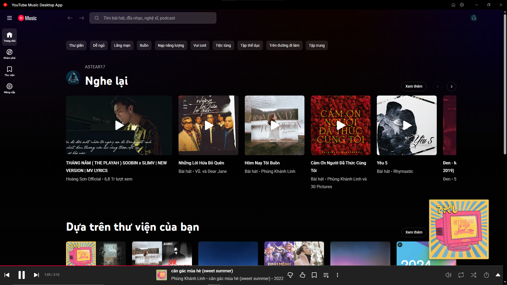

# YouTube Music Desktop App

A cross-platform desktop application for YouTube Music, providing a native experience with enhanced features.



[![Discord][discord-img]][discord-url]
[![GitHub license][license-img]][license-url]
[![GitHub release][release-img]][release-url]
[![Download][download-img]][download-url]

## Features

- **Native Experience**: Integrated media keys, taskbar controls, and desktop notifications.
- **Customization**: Support for custom CSS themes, including a built-in Liquid Glass aesthetic.
- **Integrated Adblocker**: Built-in protection against advertisements and tracking.
- **Cross-Platform**: Available for Windows, macOS, and Linux.
- **Integrations**: Support for Last.fm scrobbling, Discord Rich Presence, and more.

## Download

The latest version can be downloaded from the [Releases](https://github.com/ytmdesktop/ytmdesktop/releases) page.

### Windows
- **Winget**: `winget install "YouTube Music Desktop App"` or `winget install Ytmdesktop.Ytmdesktop`
- **Scoop**: `scoop bucket add extras` then `scoop install ytmdesktop`
- **Direct Download**: Available in the Releases section.

### macOS
- **Homebrew**: `brew install --cask ytmdesktop-youtube-music`
- **Direct Download**: Available in the Releases section.

### Linux
- **Arch Linux (AUR)**: `https://aur.archlinux.org/packages/ytmdesktop`
- **Direct Download**: Available in the Releases section (AppImage, Deb, RPM).

## Development

### Prerequisites
- [Git](https://git-scm.com)
- [Node.js (v20 or higher)](https://nodejs.org)
- [Yarn](https://yarnpkg.com)

### Getting Started
1. Clone the repository:
   ```bash
   git clone https://github.com/ytmdesktop/ytmdesktop.git
   ```
2. Navigate to the project directory:
   ```bash
   cd ytmdesktop
   ```
3. Enable Corepack to use the included Yarn version:
   ```bash
   corepack enable
   ```
4. Install dependencies:
   ```bash
   yarn install
   ```
5. Start the application in development mode:
   ```bash
   yarn start
   ```

## Building

To package the application for your current platform, run:
```bash
yarn make
```

### Build Requirements
- **Windows**: Requires [Electron Build Tools](https://github.com/electron/build-tools) or Visual Studio with C++ build tools.
- **Linux**: Requires `fakeroot` and `dpkg` (for Debian/Ubuntu) or `rpm` (for RedHat/Fedora).

## Contributors

We would like to thank all the contributors who have helped expand this project.

[adlerluiz](https://github.com/adlerluiz) | [NovusTheory](https://github.com/NovusTheory) | [mingjun97](https://github.com/mingjun97) | [rickpalmeira](https://github.com/rickpalmeira) | [Alipoodle](https://github.com/Alipoodle) | [flleeppyy](https://github.com/flleeppyy) | [zagoruev](https://github.com/zagoruev) | [Venipa](https://github.com/Venipa) | [serjan-nasredin](https://github.com/serjan-nasredin) | [TotalChris](https://github.com/TotalChris) | [ArnyminerZ](https://github.com/ArnyminerZ) | [TotallyNotInUse](https://github.com/TotallyNotInUse) | [ddarkr](https://github.com/ddarkr) | [pinkiesky](https://github.com/pinkiesky) | [NNowakowski](https://github.com/NNowakowski) | [dm3ch](https://github.com/dm3ch) | [Vistaus](https://github.com/Vistaus) | [smarquespt](https://github.com/smarquespt) | [peter9811](https://github.com/peter9811) | [KageRyo](https://github.com/KageRyo) | [andrew000](https://github.com/andrew000) | [danparidae](https://github.com/danparidae) | [tbvjaos510](https://github.com/tbvjaos510) | [andia89](https://github.com/andia89) | [nils-kt](https://github.com/nils-kt) | [Nerogar](https://github.com/Nerogar) | [nattadasu](https://github.com/nattadasu) | [mkotb](https://github.com/mkotb) | [chaoky](https://github.com/chaoky) | [ElectricalBoy](https://github.com/ElectricalBoy)

## License

This project is licensed under the GPL-3.0 License. See the [LICENSE](LICENSE) file for details.

[discord-img]: https://img.shields.io/badge/Discord-JOIN-GREEN.svg?style=for-the-badge&logo=discord
[discord-url]: https://discord.gg/88P2n2a
[license-img]: https://img.shields.io/github/license/ytmdesktop/ytmdesktop.svg?style=for-the-badge&logo=librarything
[license-url]: https://github.com/ytmdesktop/ytmdesktop/blob/master/LICENSE
[release-img]: https://img.shields.io/github/release/ytmdesktop/ytmdesktop.svg?style=for-the-badge&logo=flattr
[release-url]: https://GitHub.com/ytmdesktop/ytmdesktop/releases/
[download-img]: https://img.shields.io/github/downloads/ytmdesktop/ytmdesktop/total.svg?style=for-the-badge&logo=data:image/svg+xml;base64,PHN2ZyBhcmlhLWhpZGRlbj0idHJ1ZSIgZGF0YS1wcmVmaXg9ImZhcyIgZGF0YS1pY29uPSJjbG91ZC1kb3dubG9hZC1hbHQiIGNsYXNzPSJzdmctaW5saW5lLS1mYSBmYS1jbG91ZC1kb3dubG9hZC1hbHQgZmEtdy0yMCIgeG1sbnM9Imh0dHA6Ly93d3cudzMub3JnLzIwMDAvc3ZnIiB2aWV3Qm94PSIwIDAgNjQwIDUxMiI+PHBhdGggZmlsbD0iI0ZGRiIgZD0iTTUzOCAyMjdjNC0xMSA2LTIzIDYtMzVhOTYgOTYgMCAwMC0xNDktODAgMTYwIDE2MCAwIDAwLTI5OSA4OCAxNDQgMTQ0IDAgMDA0OCAyODBoMzY4YTEyOCAxMjggMCAwMDI2LTI1M3ptLTEzMyA4OEwyOTkgNDIxYy02IDYtMTYgNi0yMiAwTDE3MSAzMTVjLTEwLTEwLTMtMjcgMTItMjdoNjVWMTc2YzAtOSA3LTE2IDE2LTE2aDQ4YzkgMCAxNiA3IDE2IDE2djExMmg2NWMxNSAwIDIyIDE3IDEyIDI3eiIvPjwvc3ZnPg==
[download-url]: https://github.com/ytmdesktop/ytmdesktop/releases/
